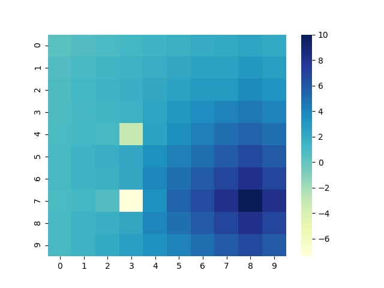

# How to run?

切换至源文件所在目录
输入

```shell
g++ ./GridWorld.cpp -o GridWorld.exe
./GridWorld.exe
```

运行结束后

终端会打印出最终的收敛的值函数与策略函数


终端输入

```shell
python draw.py
```

会绘制最终的热力图，并保存为ValueIteration.jpg。

## 收敛结果

收敛热力图



收敛的策略值

```
  0.41      0.74      0.96      1.18      1.43      1.71      1.98      2.11      2.39      2.09
  0.73      1.04      1.27      1.52      1.81      2.15      2.47      2.58      3.02      2.69
  0.86      1.18      1.45      1.76      2.15      2.55      2.97      3.00      3.69      3.32
  0.84      1.11      1.31      1.55      2.45      3.01      3.56      4.10      4.53      4.04
  0.91      1.20      1.09     -3.00      2.48      3.53      4.21      4.93      5.50      4.88
  1.10      1.46      1.79      2.24      3.42      4.20      4.97      5.85      6.68      5.84
  1.06      1.41      1.70      2.14      3.89      4.90      5.85      6.92      8.15      6.94
  0.92      1.18      0.70     -7.39      3.43      5.39      6.67      8.15     10.00      8.19
  1.09      1.45      1.75      2.18      3.89      4.88      5.84      6.92      8.15      6.94
  1.07      1.56      2.05      2.65      3.38      4.11      4.92      5.83      6.68      5.82
```


增加了栅格世界3x3的python版本，非常的简单。
